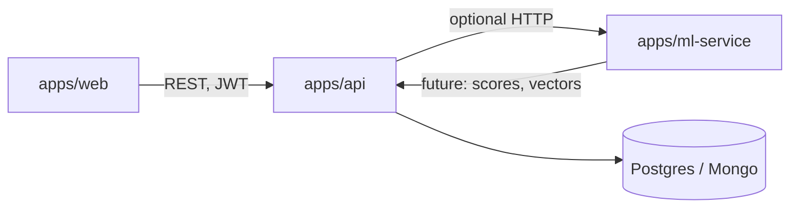

# Orbiton — Maintainer handover

This document explains what the project is today, how to run and extend it, what is **implemented and usable** in the current handoff, and what is **planned** (especially intelligence features for students and TPOs). For the detailed ML methodology and product modules, see [ML_PRODUCT_SPEC.md](ML_PRODUCT_SPEC.md) and the delivery epics in [ROADMAP.md](ROADMAP.md).

## Purpose and scope

**Orbiton** is a campus placement management system: a **React (Vite) web app**, a **Node.js (Express) API** with **JWT** and **RBAC**, an **OpenAPI** contract in `packages/openapi`, and a small **Flask** service under `apps/ml-service` for future model endpoints. Infrastructure references **PostgreSQL** (transactional) and **MongoDB** (derived/intelligence) with SQL migrations under `infrastructure/db` — the API can run with **in-memory mock data** for many modules without a live DB, depending on how routes are implemented.

**Document map**

| Document | Use |
|----------|-----|
| [README.md](../README.md) | First-run, workspaces |
| [architecture/overview.md](architecture/overview.md) | Runtime and backend principles |
| [ML_PRODUCT_SPEC.md](ML_PRODUCT_SPEC.md) | Target resume scoring, matching, and prediction spec |
| [ROADMAP.md](ROADMAP.md) | Epics, acceptance, API sketch for intelligence work |

## Repository map

| Path | Role |
|------|------|
| `apps/web` | Vite + React; feature folders under `src/features/`; `src/app/router` for routes; `src/shared/api` for HTTP clients |
| `apps/api` | Express: `src/modules/*` per domain (drives, companies, applications, etc.); `src/modules/index.js` mounts routers; JWT via `core/middleware` |
| `apps/ml-service` | Flask: `/health`, `/v1/status` (planned capabilities); not yet called by production web flows for scoring |
| `packages/openapi` | `openapi.yaml` — keep in sync when adding REST contracts |
| `infrastructure/db` | Postgres/Mongo SQL and setup notes; `resume` / `resume_scores` tables exist in schema (see [First-run: data and persistence](#first-run-data-and-persistence)) |

## How to run (development)

1. **Install (root):** `npm install`
2. **Environment**
   - API: copy `apps/api/.env.example` to `apps/api/.env` and set `JWT_SECRET`, and DB URLs if you use Postgres/Mongo. Default dev patterns use `CORS_ORIGIN=http://localhost:5173` for the Vite port.
   - Web: if the API is not on the same origin, set `VITE_API_URL` (e.g. `http://localhost:5000`) in `apps/web` as needed for `fetch` base URL in `src/shared/api/client.js`.
3. **Databases (optional for full stack):** Docker Compose under `infrastructure/docker` and schema under `infrastructure/db/postgres` per root README. Many list/detail flows use **mock data** in `apps/api` (e.g. `recruiters/mockData.js`) so you can run UI + API without seeding real rows.
4. **Start**
   - API: `npm run dev:api` (workspace `@orbiton/api` — see `apps/api/package.json` for the exact `dev` script, typically the Express app on a port from `.env`, often **5000**).
   - Web: `npm run dev:web` — Vite default **http://localhost:5173**
   - ML: `npm run dev:ml` — Flask on port **8000** per `app.py` (intelligence layer scaffold only)
5. **Build check (web):** `npm run build --workspace @orbiton/web` or from `apps/web`: `npx vite build`
6. **Auth:** The app uses stored JWT. Demo/session flows are described in the API (e.g. session demo token in OpenAPI) — the next owner should document institutional login policies.

## High-level architecture

## Implemented surface (operational in this handoff)

The following is grounded in the repo structure and routes; it is the **intended** “usable” set for a local demo with mock-backed APIs.

### Authentication and roles

- JWT middleware on protected API routes; roles include **STUDENT**, **FACULTY**, **ADMIN**, **RECRUITER**, **TPO** (see `apps/api` role constants and web `AuthProvider` / `RequireRole`).

### Drives (discovery vs recruiter)

- **Public / discovery:** `GET /api/v1/drives` returns **PUBLISHED** drives only. Drive lifecycle is **DRAFT | PUBLISHED | CLOSED** (legacy `ACTIVE` in storage is treated as PUBLISHED where normalized).
- **Recruiter — My Drives** (`/drives/mine`, **RECRUITER-only** in the router):
  - `GET /api/v1/drives?created_by=me` — list with metrics (applicants, shortlisted, selected counts, deadlines, `created_at`, etc.)
  - `PATCH /api/v1/drives/:id/status` — status transitions
  - `DELETE /api/v1/drives/:id` — **draft-only**
  - `PATCH /api/v1/drives/:id` — partial field updates (status changes use the status endpoint)
- **Web:** [MyDrivesPage](../apps/web/src/features/drives/MyDrivesPage.jsx) — table, filters, KPI filters, row actions. [DrivesPage](../apps/web/src/features/drives/DrivesPage.jsx) — student-facing discovery. **PUBLISHED** is treated as “open” in display helpers in `src/shared` where applicable.

### Companies directory

- **API:** `GET /api/v1/companies`, `GET /api/v1/companies/:id` — aggregates from recruiter + drive store.
- **Web:** [CompaniesPage](../apps/web/src/features/companies/CompaniesPage.jsx), [CompanyDetailsPage](../apps/web/src/features/companies/CompanyDetailsPage.jsx) at `/companies` and `/companies/:id`. “View drives” can deep-link to `...#drives` on the detail page.

### Recruiter dashboard

- [RecruiterDashboardLive](../apps/web/src/features/recruiter/RecruiterDashboardLive.jsx) — funnel, candidates, and drive selector. **Query param `?driveId=`** syncs the selected drive with the URL for “Manage applicants” from My Drives.
- **Layout:** Recruiter hero + funnel + insight cards use a bento layout (funnel on top, deadlines / demographics in a full-width row below) with compact styles — see `styles.css` for `recruiter-hero-bento` and `recruiter-dashboard` scoping.

### Stubs and placeholders (explicit)

- [ResumesPage](../apps/web/src/features/resumes/ResumesPage.jsx) — `FeaturePage` placeholder; no production resume scoring in the web UI.
- [CreateDrivePage](../apps/web/src/features/drives/CreateDrivePage.jsx) — placeholder unless replaced by a full form in a later pass.
- **ml-service** — health/status only; no training artifacts or model weights in the repo; see [apps/ml-service/README.md](../apps/ml-service/README.md).

## First-run: data and persistence

- **Postgres** schema includes `resumes` and `resume_scores` (skill, experience, completeness, final score columns) in `infrastructure/db/postgres/001_initial_schema.sql` — this supports a future scoring pipeline; **wiring the Express API to compute and persist these scores and exposing them in the Resumes UI is not part of the “operational web feature set” in this handoff.**
- **API mock data** for recruiters/drives is used for demos without DB seeding; production deployment should replace with real repositories and migrations.

## Future intelligence (product intent)

The stakeholder specification for **Resume Analysis**, **Job–Profile Matching**, and **Placement Outcome Prediction** — including **weighted feature-based resume scoring**, **vector + cosine similarity** for matching, and **logistic-regression-style** outcome prediction — is captured in [ML_PRODUCT_SPEC.md](ML_PRODUCT_SPEC.md). Implementation should go through the API with OpenAPI updates and optional `ml-service` workers; use feature flags for any model that is not institutionally validated.

**Non-goals for an initial ML release (recommended):** deploying opaque models to production without bias review, backtests, and TPO sign-off; storing raw résumé text in Mongo without a retention policy.

## Testing and quality

- **Web:** `vite build` is the main compile gate for the frontend.
- **API:** add or run workspace tests with `npm run test` at the root (workspaces run `--if-present`).
- **Integration:** E2E and load tests are not described as a standard part of this repo; document any CI you add in `README` or a `CONTRIBUTING.md` if introduced.

## Handoff checklist for the new owner

- [ ] Obtain **JWT** signing secret and any **Postgres** / **Mongo** connection strings for each environment
- [ ] Configure **CORS** (`CORS_ORIGIN`) for the deployed web origin
- [ ] If using object storage, set `STORAGE_BUCKET` and related credentials per `apps/api` env
- [ ] **Deployment:** [docs/architecture/overview.md](architecture/overview.md) references a public hostname pattern — update for your org
- [ ] Read [ROADMAP.md](ROADMAP.md) and [ML_PRODUCT_SPEC.md](ML_PRODUCT_SPEC.md) before scheduling ML work
- [ ] Regenerate or pin **OpenAPI** client/types if you adopt codegen from `packages/openapi`

---

*This handover is a snapshot of the repository at handoff. Update it when major modules ship or the architecture changes.*
