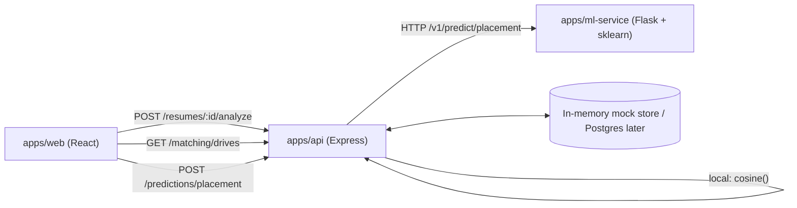

# ML Implementation Plan — Resume Analysis, Job–Profile Matching, Placement Prediction

Companion to [HANDOVER.md](HANDOVER.md), [ML_PRODUCT_SPEC.md](ML_PRODUCT_SPEC.md), and [ROADMAP.md](ROADMAP.md). This file captures **how** the three intelligence modules will be built, in what order, and which files will change.

**Architecture decisions (locked):**

- **Hybrid execution.** Resume scoring + cosine matching live in **Node** inside `apps/api` (no service hop, no Python in the hot path). Placement prediction lives in **Python** `apps/ml-service` (real `scikit-learn` `LogisticRegression`).
- **Phased data strategy.** Phase 1 takes **structured JSON** profile input on top of the existing in-memory mock store. Phase 2 layers **PDF upload + Postgres** wiring (the schema in [`infrastructure/db/postgres/001_initial_schema.sql`](infrastructure/db/postgres/001_initial_schema.sql) is already designed for this).

---

## Progress audit (verified against code, not just docs)

### Already wired

- Auth/JWT/RBAC with roles `STUDENT | FACULTY | ADMIN | RECRUITER | TPO`.
- Drives: full CRUD + lifecycle (`DRAFT | PUBLISHED | CLOSED`), recruiter "My Drives", student discovery — see [`apps/api/src/modules/drives/`](apps/api/src/modules/drives) and [`apps/web/src/features/drives/`](apps/web/src/features/drives).
- Companies directory ([`apps/api/src/modules/companies/`](apps/api/src/modules/companies)).
- Applications: apply / shortlist / reject / schedule ([`apps/api/src/modules/applications/`](apps/api/src/modules/applications)).
- Recruiter dashboard live ([`apps/web/src/features/recruiter/RecruiterDashboardLive.jsx`](apps/web/src/features/recruiter/RecruiterDashboardLive.jsx)).
- Notifications, Student dashboard skeleton.
- **Postgres schema fully designed** for ML: `resumes`, `resume_scores`, `student_profiles`, `student_skills`, `drive_required_skills`, `skills`, `certifications`, `student_marks` (lines 22–183 of `001_initial_schema.sql`). Schema exists; the API still runs on mocks.
- OpenAPI documents auth, drives, companies, applications, recruiter, tpo, admin paths.

### Stubs (named like ML, but inert)

- [`apps/ml-service/app.py`](apps/ml-service/app.py): `/health` + `/v1/status` returning the strings `resume-analysis-planned`, `job-matching-planned`, `placement-prediction-planned`. `scikit-learn` is in `requirements.txt` but never imported.
- [`apps/api/src/modules/resumes/index.js`](apps/api/src/modules/resumes/index.js): only `GET /storage/adapter`.
- [`apps/web/src/features/resumes/ResumesPage.jsx`](apps/web/src/features/resumes/ResumesPage.jsx): static `FeaturePage` placeholder.
- [`apps/api/src/modules/students/index.js`](apps/api/src/modules/students/index.js) `GET /profile/me`: hard-coded JSON.
- [`apps/api/src/integrations/intelligence/index.js`](apps/api/src/integrations/intelligence/index.js): returns `{ status: "planned" }`, never calls ml-service.
- [`apps/api/src/modules/skills/index.js`](apps/api/src/modules/skills/index.js): empty scaffold.

### Zero code today

- Resume parsing, scoring, score persistence, score retrieval API.
- Vector encoding + cosine similarity, `/matching/*` endpoints, "match %" UI.
- Placement prediction model, training pipeline, `/predictions/*` endpoint, prediction UI.
- OpenAPI entries for any of the three modules.

---

## Target architecture



Resume scoring and cosine matching never leave Node. Only placement prediction crosses the network boundary into Python.

---

## Phase 1 — Demoable end-to-end on mock data

### 1A. Resume Analysis (Node, weighted feature-based)

**Inputs:** structured JSON profile — `{ skills[], projects[], education{cgpa,degree,branch,year}, experience[{role,durationMonths,internship}], completeness{sections[]} }`.

**Output shape (returned to UI and ready for `resume_scores` columns):**

```json
{
  "resumeId": "uuid",
  "modelVersion": "rs-v0.1.0",
  "computedAt": "2026-04-26T...",
  "subscores": {
    "skills":       { "score": 0.74, "weight": 0.30, "details": { "matched": 12, "diversity": 0.6 } },
    "education":    { "score": 0.82, "weight": 0.15, "details": { "cgpa": 8.4, "relevance": 1.0 } },
    "projects":     { "score": 0.55, "weight": 0.20, "details": { "count": 3, "relevance": 0.6 } },
    "experience":   { "score": 0.40, "weight": 0.20, "details": { "internshipMonths": 4 } },
    "completeness": { "score": 0.90, "weight": 0.15, "details": { "missingSections": [] } }
  },
  "finalScore": 67.2
}
```

**Files to add / edit:**

- New `apps/api/src/modules/resumes/scoring/` with:
  - `features.js` — pure functions per category (skills, education, projects, experience, completeness).
  - `weights.js` — institution-tunable defaults (`SKILLS:0.30, EDU:0.15, PROJ:0.20, EXP:0.20, COMP:0.15`).
  - `scorer.js` — orchestrator: returns the JSON shape above.
- Edit [`apps/api/src/modules/resumes/index.js`](apps/api/src/modules/resumes/index.js) — add:
  - `POST /resumes/:id/analyze` (auth: owner student or TPO scope).
  - `GET /resumes/:id/score` (latest).
  - `PUT /resumes/me/profile` — accept structured JSON for Phase 1 (drops naturally when PDF upload arrives).
- Persist to mock store mirror at `apps/api/src/modules/resumes/store.js` (Phase 1) — schema already mapped to `resume_scores` columns so Phase 2 wiring is mechanical.
- Web: replace [`apps/web/src/features/resumes/ResumesPage.jsx`](apps/web/src/features/resumes/ResumesPage.jsx) with:
  - Profile form (skills tagger, projects, education, experience).
  - Score view: aggregate + radar/bar of subscores + actionable bullets ("Add 2 more domain projects", etc.).
  - Add `apps/web/src/shared/api/resumes.js` client.

### 1B. Job–Profile Matching (Node, cosine over shared vocabulary)

**Vector schema:** versioned, identical for student and drive. Dimensions = `[skills_vocab... , edu_buckets... , exp_features...]`. The skills vocabulary comes from `apps/api/src/modules/skills/` (today empty — we seed a starter taxonomy in `apps/api/src/data/skillsTaxonomy.js`).

**Encodings:**

- Skills → binary per vocab dim.
- Keywords (from project titles / drive description) → TF–IDF over the same vocab.
- Education → one-hot over branch buckets + normalized CGPA.
- Experience → `[normalized_total_months, has_internship]`.

**Files to add:**

- New `apps/api/src/modules/matching/` with:
  - `vocabulary.js` (versioned export `VOCAB_VERSION = "v1"`).
  - `encoder.js` — `encodeStudent(profile)`, `encodeDrive(drive)` → `Float32Array`-style same-length vectors.
  - `similarity.js` — pure `cosine(a,b)` with zero-norm guard.
  - `service.js`, `controller.js`, `index.js`.
- Endpoints (RBAC-gated, rate-limited via existing middleware):
  - `GET /matching/drives` (student session) → ranked drives `[{ driveId, similarity, topContributingDimensions[] }]`.
  - `GET /matching/students?driveId=` (TPO/recruiter scope).
- Web:
  - "Match %" badge on drive cards in [`apps/web/src/features/drives/DrivesPage.jsx`](apps/web/src/features/drives/DrivesPage.jsx) and student dashboard.
  - Add `apps/web/src/shared/api/matching.js`.

### 1C. Placement Prediction (Python `ml-service`, logistic regression baseline)

**Why Python here, not Node:** real `sklearn.linear_model.LogisticRegression` with calibration (`CalibratedClassifierCV`) is meaningfully better than a hand-rolled JS LR for governance/audit, and `scikit-learn` is already pinned in [`apps/ml-service/requirements.txt`](apps/ml-service/requirements.txt).

**Training data (Phase 1):** synthetic dataset generator in `apps/ml-service/training/synthetic.py` using historical-shaped features (CGPA, backlogs, skill match, project count, internship months, drive selectivity proxy) → binary `placed` label. **Clearly tagged `modelVersion: "lr-synthetic-v0.1"`** in responses so it cannot be confused for a production model.

**Files to add:**

- `apps/ml-service/app.py` — extend with:
  - `POST /v1/predict/placement` body `{ features: {...}, driveContext?: {...} }` → `{ probability, riskBand, modelVersion, computedAt }`.
  - `GET /v1/status` updated to flag this as `beta`.
- `apps/ml-service/training/` — `synthetic.py`, `train.py`, `model.joblib` (committed for dev; production swap is a config change).
- `apps/ml-service/inference.py` — load `model.joblib`, single-row predict.
- API proxy:
  - Edit [`apps/api/src/integrations/intelligence/index.js`](apps/api/src/integrations/intelligence/index.js) — add `predictPlacement(payload)` actually calling `${ML_BASE_URL}/v1/predict/placement` with timeout + circuit-breaker.
  - New `apps/api/src/modules/predictions/` with `POST /predictions/placement` (TPO-only by default; student-visible behind feature flag `ENABLE_STUDENT_PREDICTION_VIEW`).
- Web: TPO dashboard widget in [`apps/web/src/features/recruiter/`](apps/web/src/features/recruiter) or a new `apps/web/src/features/tpo/` view with risk-band cohort table; behind flag for student-facing.

### Cross-cutting in Phase 1

- **OpenAPI**: add `/resumes/:id/analyze`, `/resumes/:id/score`, `/matching/drives`, `/matching/students`, `/predictions/placement` to [`packages/openapi/openapi.yaml`](packages/openapi/openapi.yaml). Every response includes `modelVersion` + `computedAt`.
- **Feature flags**: env-driven `ENABLE_RESUME_SCORING`, `ENABLE_MATCHING`, `ENABLE_PREDICTION` so anything not yet TPO-approved stays off in prod.
- **Audit / privacy**: log `{ userId, route, modelVersion, latencyMs }` only — no raw resume text in API logs (matches non-goals in [HANDOVER.md](HANDOVER.md) §Future intelligence).
- **Tests**: golden-file unit tests for `scorer.js` and `cosine()`; pytest for the Python predictor; one happy-path integration test per route.

---

## Phase 2 — Production-shaped persistence

Triggered after Phase 1 demos cleanly. Mechanical, low-risk:

1. PDF upload using `apps/api/src/integrations/storage/` (already returns adapter). Local disk for dev; S3 adapter behind same interface.
2. Resume parser worker (Node `pdf-parse` or call into ml-service `POST /v1/resume/parse` if heavier NLP is wanted later). Output → same structured JSON Phase 1 already accepts → existing scorer reuses unchanged.
3. Wire Postgres for `student_profiles`, `resumes`, `resume_scores`, `student_skills`, `drive_required_skills` — replace mock-store calls in `resumes`, `students`, `matching` modules with repositories. Schema already exists; this is plumbing.
4. Replace synthetic prediction model with one trained on real anonymized historical placement data, gated by TPO sign-off and a bias review checklist (per [ROADMAP.md](ROADMAP.md) Epic C governance).

---

## Out of scope (explicit non-goals)

- Deep-learning embeddings (BERT/sentence-transformers). The spec is explicit about TF–IDF + cosine for transparency.
- Auto-reject decisions or any system that hides a human-in-the-loop step for prediction (per [ML_PRODUCT_SPEC.md](ML_PRODUCT_SPEC.md) §3 deployment policy).
- Storing raw résumé text in Mongo without retention policy.
- Replacing the existing drive/companies/recruiter UIs — only **additive** integration points (match badge, score widget, prediction widget).

---

## First-PR checklist (the slice I would land first)

A single thin vertical that makes Resume Analysis live end-to-end on mock data — proving the architecture before fanning out:

- [ ] `apps/api/src/modules/resumes/scoring/{features,weights,scorer}.js` with unit tests.
- [ ] `POST /resumes/:id/analyze` + `GET /resumes/:id/score` + `PUT /resumes/me/profile` in [`apps/api/src/modules/resumes/index.js`](apps/api/src/modules/resumes/index.js).
- [ ] In-memory store mirroring `resume_scores` columns.
- [ ] `apps/web/src/shared/api/resumes.js`.
- [ ] Replace [`apps/web/src/features/resumes/ResumesPage.jsx`](apps/web/src/features/resumes/ResumesPage.jsx) with profile form + score view.
- [ ] OpenAPI entries for the three new resume routes.
- [ ] `vite build` + API tests green.

Then 1B (matching) and 1C (prediction) ship as their own PRs against the same scaffolding.
